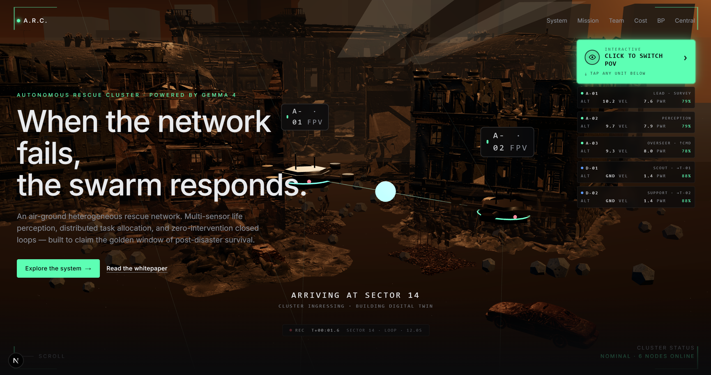
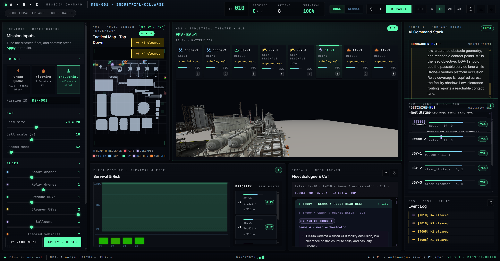

# A.R.C. — Autonomous Rescue Cluster

**Gemma 4 on LiteRT · offline disaster response**

Post-disaster heterogeneous rescue fleet (**UAV + UGV + aerostat**) coordinated by **Decision Hubs** with **Gemma 4** reasoning at the edge (**LiteRT E4B**) and optional cloud planning. Built for the **Gemma 4 Good Hackathon** (Impact: Global Resilience · Technology: LiteRT).

<p align="center">
  
  <br/>
  <em>Marketing homepage (<code>/</code>) — project overview and entry to the live demo.</em>
</p>

<p align="center">
  
  <br/>
  <em>Mission Command (<code>/simulation</code>) — tactical map, fleet FPV, and Gemma 4 Decision Hub.</em>
</p>

| Live demo | Precomputed playback |
|-----------|----------------------|
| [Mission Command](/simulation) — real Gemma 4 inference | [/demo-player](/demo-player) — timeline JSON replay |
| Requires local LiteRT weights + bridge | Works without GPU / model file |

---

## Judge Quick Start (LiteRT only)

```bash
# 1) Download Gemma 4 E4B LiteRT weights → models/gemma-4-E4B-it.litertlm
#    https://huggingface.co/litert-community/gemma-4-E4B-it-litert-lm

pip install -r requirements.txt
pnpm install

# Terminal A — LiteRT OpenAI bridge (default :8787)
python scripts/litert_openai_server.py
# or: pnpm litert:server

# Terminal B — copy env and start Next.js
cp .env.example .env.local
# Edit .env.local — keep only:
#   LITERT_OPENAI_BASE_URL=http://127.0.0.1:8787/v1

pnpm dev
```

Open **http://localhost:3000/simulation?ai=gemma**

1. Click **GEMMA4** (not MOCK).  
2. Wait for header **● LIVE Gemma 4**.  
3. Confirm the **metrics panel** (MODE · BACKEND · LATENCY · …).  
4. Press **RUN**.

**Health check**

```bash
curl http://localhost:3000/api/gemma-chat
# → {"ok":true,"backend":"litert","model":"gemma-4-E4B-it-litertlm",...}
```

**Apple Silicon (M1/M2/M3/M4):** `.env.example` enables `LITERT_BACKEND=gpu` /
`LITERT_VISION_BACKEND=gpu` by default — Metal is dramatically faster than CPU.
Comment those lines out on Intel/AMD machines without a supported GPU build.

**Measure latency:** `bash scripts/bench_gemma.sh` runs three prompts per agent
and reports min/median/max from the `X-Arc-Latency-Ms` header. The browser
console also logs `[gemma] agent=… latency=…ms tokens=…` during a live round.

---

## What this repo contains

```
arc_core/          Python package — agents, GemmaPerceiver, simulation, tests
app/               Next.js 15 App Router
public/simulation/ Mission Command (static UI + /api/gemma-chat)
scripts/           litert_openai_server.py — OpenAI-compatible LiteRT bridge
models/            Place gemma-4-E4B-it.litertlm here (not in git)
Writeup.md         Kaggle submission narrative
```

**Inference path (submission):** browser → `POST /api/gemma-chat` → `LITERT_OPENAI_BASE_URL` → `scripts/litert_openai_server.py` → **Gemma 4 E4B** (multimodal FPV supported).

---

## Web routes

| URL | Description |
|-----|-------------|
| `/` | Marketing site (Three.js hero) |
| `/simulation` | **Mission Command** — tactical map, FPV, Decision Hub, fleet dialogue |
| `/simulation?ai=gemma` | Default live AI mode |
| `/simulation?ai=mock` | Rule-based / template mode (labeled honestly in UI) |
| `/lite` | 2D lite sim (`public/lite/scenario_canvas_lite.json`) |
| `/demo-player` | MapLibre + canvas timeline playback |
| `/whitepaper` | System design document |

---

## Mission Command (`/simulation`)

- **GEMMA4 / MOCK** toggle — use **GEMMA4** for hackathon screenshots and video.  
- **AI metrics panel** (screenshot-friendly): `MODE · BACKEND · LATENCY · TOKENS · AGENT · ROUND`.  
- **Phase label** syncs with mode: `CLOSED LOOP · GEMMA-4 (LiteRT)` vs `SIMULATION · RULE-BASED`.  
- **Footer uplink/plan** — measured latency or `(simulated)` in MOCK mode (no fake fixed ms).  
- **Agents:** Drone_Alpha (vision), Track_Beta, Relay_Gamma, Orchestrator — via streaming/non-streaming chat.

FPV frames are sent as JPEG base64 to LiteRT ([conversation schema](https://github.com/google-ai-edge/LiteRT-LM/blob/main/docs/api/cpp/conversation.md)).

---

## Models (hackathon compliance)

| Role | Model | Where |
|------|--------|--------|
| **Edge inference (required for live demo)** | [`litert-community/gemma-4-E4B-it-litert-lm`](https://huggingface.co/litert-community/gemma-4-E4B-it-litert-lm) | `models/gemma-4-E4B-it.litertlm` |
| **Cloud planning (optional)** | `gemma-4-26b-a4b-it` | `GEMMA_API_MODEL` in `GemmaPerceiver` / timeline |

Function-calling tools in `arc_core`: `calculate_survival_score`, `dispatch_rescue_task`.

---

## Environment variables

Copy `.env.example` → `.env.local` for Next.js.

| Variable | Required | Description |
|----------|----------|-------------|
| `LITERT_OPENAI_BASE_URL` | **Yes** (live demo) | e.g. `http://127.0.0.1:8787/v1` |
| `LITERT_MODEL_PATH` | No | Path to `.litertlm` (default: `models/gemma-4-E4B-it.litertlm`) |
| `LITERT_BACKEND` | No | `cpu` or `gpu` (LLM) |
| `LITERT_VISION_BACKEND` | No | `cpu` or `gpu` (vision tower) |
| `LITERT_SERVER_PORT` | No | Bridge port (default `8787`) |
| `GEMMA_API_KEY` | No | Google AI Studio — timeline / API mode |
| `GEMMA_API_MODEL` | No | Default `gemma-4-26b-a4b-it` |
| `GEMMA_MODE` | No | `litert` \| `api` \| `mock` \| `auto` for Python |

---

## Install & run (full)

### Python

```bash
pip install -r requirements.txt

# Skeleton demo
python -m arc_core.runners

# Precompute timeline for demo-player
python -m arc_core.simulation.timeline_generator --steps 200 --output public/demo-player/timeline.json

# Tests
pytest
```

Timeline uses **`GemmaPerceiver`** when `GEMMA_API_KEY` is set or LiteRT weights exist; otherwise rule/mock trajectory.

### Node.js

```bash
pnpm install
pnpm dev          # http://localhost:3000
pnpm build        # production build
pnpm litert:server # shortcut for LiteRT bridge
```

### Demo player

```bash
# Ensure timeline exists (see Python section above)
pnpm dev
# → http://localhost:3000/demo-player
```

---

## Python architecture (`arc_core`)

| Module | Purpose |
|--------|---------|
| `perception/gemma_perceiver.py` | Gemma 4 backends: LiteRT → API → Mock |
| `agents/decision_hub.py` | Cluster “brain”, task allocation |
| `simulation/timeline_generator.py` | Offline timeline JSON |
| `scheduler/` | Survival scoring, task allocator |

```bash
python -c "from arc_core.perception.gemma_perceiver import GemmaPerceiver; print(GemmaPerceiver(agent_id='t').stats())"
# Expect mode=litert when weights are present
```

---

## API: `/api/gemma-chat`

| Method | Description |
|--------|-------------|
| `GET` | LiteRT health via bridge `/health` |
| `POST` | Chat proxy; body: `{ agent, message, history?, image_base64?, stream? }` |

Non-stream response includes **`meta`**: `backend`, `latency_ms`, `model`, `tokens` (may be `null` on edge).

---

## Troubleshooting

| Symptom | Fix |
|---------|-----|
| `LITERT_OPENAI_BASE_URL not configured` | Create `.env.local` from `.env.example` |
| Header stays MOCK / offline | Start `python scripts/litert_openai_server.py`; check `curl localhost:8787/health` |
| Empty or slow first reply | Model load on first request; CPU inference can take tens of seconds |
| Metrics show `LATENCY · —` | Run one GEMMA4 round after LIVE badge appears |
| `/demo-player` empty map | Run timeline_generator; check `public/demo-player/timeline.json` |

Optional GPU: `LITERT_BACKEND=gpu LITERT_VISION_BACKEND=gpu python scripts/litert_openai_server.py`

---

## Submission docs

| File | Purpose |
|------|---------|
| [**Writeup.md**](Writeup.md) | Kaggle writeup — problem, architecture, impact |
| [**whitepaper.md**](whitepaper.md) | Extended system design |

---

## Safety

A.R.C. is **decision support** for research and hackathon demonstration. It does not replace certified incident command or professional rescue teams.

---

## Acknowledgements

- [LiteRT-LM](https://github.com/google-ai-edge/LiteRT-LM) (Google AI Edge)  
- [Gemma 4](https://deepmind.google/models/gemma/)  
- Multi-agent UAV–UGV planning and disaster-resilience literature cited in team materials  

## License

MIT — see [LICENSE](LICENSE).

**Demo video & cover:** see the [Kaggle submission](https://www.kaggle.com/competitions/gemma-4-good-hackathon) (project writeup, gallery, and linked media).
